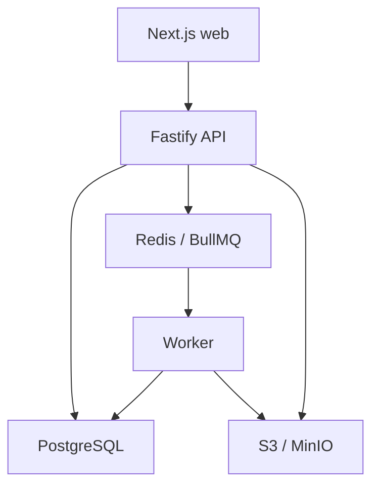

# Техническое задание для Codex: сервис базы участников ЦПИ

Версия: 1.0  
Дата: 22 июля 2026 года  
Статус: требования к MVP зафиксированы  
Исходные материалы:

- `Участники_всех_мероприятий_Стартап_студии_ЯДРО1.xlsx` — 34 листа;
- `ЦПИ_ФПФ.docx` — логика процессов ЦПИ;
- `CRM_CPI_blueprint.md` — аудит исходных данных и общая целевая архитектура.

Этот документ уточняет и переопределяет прежний blueprint в части активации, удержания, оценки артефактов и границ первой версии. Если требования расходятся, использовать этот документ.

---

## 1. Задача Codex

Нужно создать внутренний веб-сервис для ведения единой базы участников ЦПИ. Сервис должен заменить разрозненные Excel-листы, обеспечить быстрый поиск, безопасную работу с дублями и дать развёрнутую карточку участника — «головы» — с историей, связями и артефактами.

Первая версия является артефактоцентричным реестром участников, но архитектура не должна мешать дальнейшему развитию в полноценную CRM.

Главный результат MVP:

```text
единый человек → участия и проекты → созданные артефакты → качество 1–10
                 → текущая активность → рабочая очередь комьюнити-менеджера
```

Экономику в этой версии не считать.

### Как работать с этим ТЗ

1. Сначала изучить существующий репозиторий, `AGENTS.md`, README, текущий стек, миграции и правила деплоя.
2. Не заменять рабочую архитектуру только ради совпадения с рекомендациями ниже. Если репозиторий уже существует, встроить модули в него и документировать отклонения.
3. Если репозиторий пустой, использовать рекомендуемую структуру из раздела 9.
4. До кода составить короткий план по этапам и список обнаруженных рисков.
5. Делать миграции вперёд; не удалять исходные данные и не выполнять необратимые преобразования.
6. После каждого этапа запускать форматирование, lint, typecheck и соответствующие тесты.
7. Не развёртывать production и не менять внешнюю инфраструктуру без отдельного разрешения.

---

## 2. Зафиксированные продуктовые решения

Эти решения не нужно повторно уточнять:

1. В интерфейсе использовать термин **«Участник»**. «Голова» — внутренний бизнес-термин, а не название таблицы или класса.
2. Один `Person` соответствует одному реальному человеку.
3. Участник активирован, когда он хотя бы один раз создал и отправил учитываемый артефакт.
4. Черновик не активирует участника.
5. Оценка или принятие артефакта не влияют на сам факт активации.
6. Качество каждой версии артефакта оценивается целым числом от 1 до 10.
7. Отсутствие оценки хранится как `null`, а не как `0`.
8. Текущая активность определяется временем с момента последнего учитываемого артефакта:
   - не более 1,5 недели — активный;
   - больше 1,5 недели, но не больше 3 недель — средняя активность;
   - больше 3 недель — неактивный.
9. `1,5 недели = 252 часа`, `3 недели = 504 часа`.
10. Экономика, выручка, затраты, Throughput и средний чек не входят в MVP.
11. Нечёткое совпадение никогда не должно автоматически объединять людей.
12. Слияние карточек должно быть обратимым и не должно уничтожать исходные строки.

### Не смешивать активацию и текущую активность

У человека должны быть две независимые характеристики:

- `activation_state` — создавал ли он артефакт хотя бы однажды;
- `activity_status` — насколько давно он создавал последний артефакт.

Пример: участник может быть активирован год назад, но сейчас иметь статус `INACTIVE`.

Термин «удержание» в MVP означает операционный статус по давности последнего артефакта. Это ещё не когортная метрика retention: процент удержания не считать, пока отдельно не утверждены когорта, знаменатель и момент отсчёта.

---

## 3. Границы MVP

### Обязательно реализовать

- авторизацию и ролевой доступ;
- единую карточку участника;
- ФИО, алиасы, контакты, организацию/факультет, теги и ответственного;
- минимальные связи с программами, мероприятиями, проектами и командами;
- артефакты, авторов, файлы/ссылки/текст и неизменяемые версии;
- оценку конкретной версии артефакта по шкале 1–10;
- вычисляемую активацию и текущую активность;
- быстрый поиск и серверные фильтры;
- очередь возможных дублей;
- ручные `merge`, `not duplicate` и `unmerge`;
- импорт всех 34 листов исходной книги;
- сохранение каждой исходной строки и происхождения каждого значения;
- взаимодействия, задачи/следующий шаг и временную линию;
- журнал действий;
- базовый дашборд без финансовых показателей;
- приватное хранение вложений и резервное копирование.

### Явно не реализовывать в MVP

- доходы, расходы и финансовые KPI;
- Throughput, средний чек и стоимость активации;
- сделки и коммерческую воронку;
- грантовую воронку как полноценный CRM-модуль;
- каталог партнёров и ЛПР как отдельный развитый модуль;
- прогноз продаж и атрибуцию денег;
- Telegram/Max-ботов;
- интеллектуальный подбор проектов;
- ML-прогноз оттока;
- конструктор сложных отчётов.

Исторические проектные, грантовые и партнёрские сведения из Excel нельзя терять: сохранить их в staging и, где возможно, связать с минимальными сущностями `Project`, `Program`, `Event`. Развитые процессы оставить на следующие версии.

---

## 4. Точные правила активации и удержания

### 4.1. Что считается учитываемым артефактом

Разделить два серверных признака:

- `qualifies_for_activation` — есть доказательство, что участник создал результат;
- `qualifies_for_activity` — дополнительно известна достоверная дата, поэтому можно считать окно 252/504 часа.

Версия может подтверждать активацию, если одновременно выполнены условия:

- существует отправленная версия `ArtifactVersion`;
- у версии явно указан хотя бы один участник-автор;
- есть содержимое: доступный файл, валидная внешняя ссылка или непустой текст;
- версия не является черновиком;
- версия не удалена и не помечена `VOIDED` как тестовая, ошибочная, спам или дубль;
- файл, если он есть, прошёл техническую проверку.

Для `qualifies_for_activity` дополнительно обязательно достоверное `submitted_at`. В live-контуре отправить версию без даты нельзя. Только legacy-импорт может создать доказанную отправленную версию с неизвестной датой: она даёт `ACTIVATED + UNKNOWN`, но не участвует в `last_artifact_at`.

Отклонённый, неоценённый или получивший оценку `1` артефакт всё равно считается созданным. Качество и факт действия — разные показатели.

Поля `uploaded_by` и `contributors` не совпадают по смыслу. Сотрудник может загрузить файл от имени участника. Активность получают только явно выбранные авторы, а не загрузивший сотрудник и не вся команда автоматически.

У каждого автора версии хранить `contribution_role = AUTHOR | CONTRIBUTOR`. В активность засчитываются только `AUTHOR`; перед отправкой требуется минимум один автор. При создании из карточки текущий участник подставляется автором по умолчанию, но состав можно изменить до submit.

Для версии с файлами submit фиксирует `submitted_at`, но до завершения сканирования она отображается как «Отправлен · файл проверяется» и ещё не влияет на активность. Когда все прикреплённые файлы получают `AVAILABLE`, сервер публикует событие `artifact_version_became_countable` и пересчитывает авторов по исходному `submitted_at`. `REJECTED` или `QUARANTINED` не активирует людей. В MVP все файлы отправленной версии считаются обязательными: один непроверенный/отклонённый файл блокирует всю `MIXED`-версию. Текстовая версия и версия только с валидными `http/https`-ссылками могут стать учитываемыми синхронно. Признак учитываемости вычисляется сервером и не принимается от клиента.

### 4.2. Формула

```text
last_artifact_at = MAX(submitted_at всех qualifies_for_activity версий,
                       где Person явно указан автором)

age = now_utc - last_artifact_at

если lifecycle_data_state = LEGACY_INCOMPLETE и доказанного артефакта нет:
    activation_state = UNKNOWN_LEGACY
    activity_status = UNKNOWN
иначе если доказан артефакт, но ни у одной версии нет достоверной даты:
    activation_state = ACTIVATED
    activity_status = UNKNOWN
иначе если учитываемых артефактов нет:
    activation_state = NOT_ACTIVATED
    activity_status = UNKNOWN
иначе:
    activation_state = ACTIVATED
    если age <= 252 часа:
        activity_status = ACTIVE
    иначе если 252 часа < age <= 504 часа:
        activity_status = MEDIUM
    иначе:
        activity_status = INACTIVE
```

Границы интервалов обязательны:

- ровно через 252 часа участник ещё `ACTIVE`;
- через 252 часа и 1 секунду — `MEDIUM`;
- ровно через 504 часа — ещё `MEDIUM`;
- через 504 часа и 1 секунду — `INACTIVE`.

### 4.3. Исторические данные и baseline

До миграции администратор задаёт `artifact_baseline_at` — дату, с которой фиксация артефактов считается полной.

- Достоверный артефакт учитывается независимо от того, создан он до или после baseline. Baseline не обнуляет известную историю.
- Если старый участник не имеет доказанного артефакта, это не доказывает, что он никогда их не создавал. Использовать `UNKNOWN_LEGACY`, а не автоматически `NOT_ACTIVATED` или `INACTIVE`.
- Если существование исторического артефакта доказано, но дата неизвестна: `activation_state = ACTIVATED`, `activity_status = UNKNOWN`.
- Новая карточка, впервые заведённая в полном рабочем контуре после baseline, без артефакта получает `NOT_ACTIVATED`.
- Исторический артефакт с достоверной старой датой учитывается по фактической дате и не создаёт ложную реактивацию.
- Нельзя автоматически переводить весь `UNKNOWN_LEGACY` в `INACTIVE` через 21 день без отдельного утверждённого правила очистки базы.

Не определять legacy по `persons.created_at`: старые люди импортируются уже после запуска сервиса. Хранить явный `lifecycle_data_state = LEGACY_INCOMPLETE | COMPLETE` и происхождение наблюдений `data_origin = LEGACY_IMPORT | LIVE`. Перевод legacy-профиля в `COMPLETE` выполняется отдельным аудируемым решением data steward либо утверждённым процессом baseline.

### 4.4. Дополнительные правила

- `activated_at` равен времени первого датированного доказанного артефакта и не стирается при обычном переходе в `INACTIVE`. Для подтверждённого legacy-артефакта без даты он остаётся `null`, а `activation_recorded_at` фиксирует момент внесения доказательства.
- Новая содержательная отправленная версия возвращает участника в `ACTIVE` сразу после того, как становится `qualifies_for_activity`; для файла это происходит после проверки, для текста/ссылки — синхронно.
- Изменение названия, описания или тегов не обновляет активность.
- Повторная загрузка версии с тем же `content_fingerprint` в рамках того же артефакта должна вернуть `409 DUPLICATE_CONTENT` и не обновлять активность без отдельного подтверждения с причиной; подтверждение аудируется. Если прежняя одинаковая версия `VOIDED`, отдельное подтверждение не требуется.
- После отправки содержимое, авторы и `submitted_at` версии неизменяемы. Исправление выполняется через аудируемый `VOIDED` и новую версию; повтор одинакового hash допустим, если предыдущая версия аннулирована.
- При аннулировании последней версии пересчитать статус по предыдущей учитываемой версии. Если учитываемых версий больше нет, результат зависит от `lifecycle_data_state`: `UNKNOWN_LEGACY` либо `NOT_ACTIVATED`; прежний факт остаётся только в audit/history.
- Будущую дату отправки сохранить нельзя; допустимый технический допуск времени сервера — не более 5 минут.
- `submitted_at` — фактическое время отправки результата, а `recorded_at` — серверное время внесения записи. При обычной самостоятельной отправке оба равны времени сервера. Заднее число разрешено только `community_manager`/`data_steward`, требует причины и попадает в аудит.
- Все даты хранить как `timestamptz` в UTC; отображать в настраиваемой часовой зоне организации.
- Вычисляемый статус нельзя менять обычным `PATCH` карточки.
- Каждый переход записывать в `LifecycleStatusHistory`.

API при каждом чтении и при каждом фильтре активности вычисляет актуальный статус по `last_artifact_at`, текущему времени БД и действующему набору правил. Кэш в `persons` нужен для очередей и аналитики, но не может сделать ответ устаревшим. Использовать внедряемый `Clock`, чтобы граничные тесты были детерминированными. Worker фиксирует переходы и обслуживает рабочие очереди; его часовая периодичность не меняет фактический статус в API.

`next_status_transition_at` хранит ближайшую границу. При сравнении использовать строгое `>`: на самой границе старый статус ещё действует, при любом следующем представимом моменте — новый. Если система была выключена дольше двух границ, после запуска записать оба пропущенных перехода с расчётными `effective_at` и фактическим `detected_at`.

Пороги хранить в версионируемом наборе правил. Начальные значения — 252 и 504 часа. Код не должен содержать несколько независимых копий этих констант.

---

## 5. Шкала качества артефакта

Оценка относится к конкретной версии артефакта, а не к человеку целиком.

| Балл | Якорное описание                                   |
| ---: | -------------------------------------------------- |
|    1 | Содержательного результата почти нет               |
|    2 | Есть отдельный фрагмент, задача не решена          |
|    3 | Существенно неполный сырой результат               |
|    4 | Результат понятен, но содержит критические пробелы |
|    5 | Минимально завершённый результат                   |
|    6 | Применим после заметной доработки                  |
|    7 | Добротный и практически применимый результат       |
|    8 | Высокое качество, нужны небольшие улучшения        |
|    9 | Готов к внешнему использованию                     |
|   10 | Эталонный результат, пригодный как образец         |

Правила:

- API и БД принимают только целые значения `1..10`;
- `0`, `11`, отрицательные, дробные и текстовые значения отклоняются;
- отправленная версия до проверки показывает «Не оценён»;
- сохраняются рецензент, дата, комментарий и версия шкалы;
- исправление оценки создаёт новую запись проверки, а не перезаписывает старую;
- текущей является последняя завершённая неаннулированная итоговая проверка;
- новая версия артефакта не наследует оценку старой версии;
- оценка не меняет активацию и текущую активность;
- среднюю оценку человека или проекта в MVP не считать: без утверждённой методики такая цифра вводит в заблуждение.

---

## 6. Пользовательские роли

| Роль                | Основные права                                                           |
| ------------------- | ------------------------------------------------------------------------ |
| `admin`             | Настройки, пользователи, справочники, полный доступ и просмотр аудита    |
| `community_manager` | Участники, контакты, артефакты, взаимодействия, задачи и рабочие очереди |
| `methodologist`     | Типы артефактов, шкала, просмотр материалов и оценки                     |
| `data_steward`      | Импорт, качество данных, очередь дублей, merge/unmerge                   |
| `auditor`           | Только чтение разрешённых данных и журнала действий                      |

Один пользователь может иметь несколько ролей. Отдельно предусмотреть permissions, чтобы роли не были зашиты в компоненты интерфейса.

Минимальный исполнимый набор permissions:

`people.read`, `people.write`, `contacts.read`, `contacts.write`, `artifacts.read`, `artifacts.write`, `artifacts.review`, `tasks.manage`, `imports.run`, `imports.read_raw`, `duplicates.resolve`, `audit.read`, `settings.manage`, `exports.bulk`.

Backend должен иметь централизованную матрицу `role → permissions` и тест на каждый защищённый маршрут. `data_steward` получает `imports.read_raw` и `duplicates.resolve`; `methodologist` — `artifacts.review`; `community_manager` не получает доступ к чувствительному raw staging по умолчанию; `auditor` не получает права мутации. Просмотр audit before/after с персональными значениями требует `audit.read` и также фиксируется в аудите.

СНИЛС и дата рождения не входят в обычную карточку MVP. Если они встречаются в исходниках, сохранить raw-строку в ограниченном зашифрованном staging; не выводить эти значения комьюнити-менеджеру и не индексировать для общего поиска.

---

## 7. Экраны и UX

### 7.1. Операционный дашборд

Показывать:

- всего уникальных участников;
- активированы когда-либо;
- активны сейчас;
- имеют среднюю активность;
- неактивны;
- не активированы после baseline;
- имеют неопределённый legacy-статус;
- число учитываемых отправленных версий за последние 3 недели и число их уникальных авторов;
- артефакты без оценки;
- распределение оценок 1–10;
- новые кандидаты в дубли;
- задачи с истёкшим сроком.

Каждая карточка показателя открывает соответствующий отфильтрованный список. Финансовых карточек быть не должно.

### 7.2. Список участников

Обязательные колонки:

- ФИО;
- основной телефон или email;
- организация/факультет;
- статус активности;
- дата последнего артефакта;
- количество учитываемых артефактов;
- последняя оценка;
- ответственный;
- индикатор возможного дубля.

Смысл агрегатов фиксирован:

- `Артефактов` — число уникальных `Artifact`, у которых есть хотя бы одна учитываемая версия данного автора, а не число доработок;
- `Последний артефакт` — последняя учитываемая версия по `submitted_at`;
- `Оценка последнего артефакта` — итоговая оценка именно этой версии; если она ещё не проверена, показывать «Не оценён», даже если более ранний материал имел оценку.

Сохранённые представления:

- все;
- не активированы;
- активные;
- средняя активность — главная рабочая очередь;
- неактивные;
- legacy-статус неизвестен;
- ожидают оценки;
- возможные дубли.

Фильтры:

- активация когда-либо;
- текущая активность;
- дата последнего артефакта;
- наличие и тип артефакта;
- последняя оценка в диапазоне;
- программа, мероприятие, проект;
- организация/факультет;
- ответственный;
- теги/компетенции;
- наличие кандидата в дубль;
- качество заполнения карточки.

Поиск, фильтры, сортировка и курсор страницы должны сохраняться в URL. Использовать серверную пагинацию. Быстрые действия из строки: «Добавить артефакт», «Создать задачу», «Открыть контакты», «Проверить дубль».

### 7.3. Развёрнутая карточка участника

#### Шапка

- каноническое ФИО и инициалы/фото;
- `activation_state` и `activity_status`;
- дата первой активации;
- дата последнего артефакта;
- понятное объяснение расчёта;
- обратный отсчёт до следующего статуса;
- ответственный;
- предупреждение о дублях;
- основная кнопка «Добавить артефакт».

Примеры текста статуса:

- `Активен · до средней активности 4 дня`;
- `Средняя активность · до неактивности 2 дня`;
- `Неактивен · без нового артефакта 29 дней`;
- `Не активирован · артефактов ещё нет`;
- `Статус неизвестен · исторические данные неполны`.

Цвет — дополнительный сигнал, не единственный:

- не активирован/неизвестен — серый;
- активен — зелёный;
- средняя активность — жёлтый;
- неактивен — красный.

#### Вкладка «Обзор»

- основные контакты и предпочтительный канал;
- организация, факультет, роль;
- компетенции и теги;
- программы, события, проекты и команды;
- текущая задача и следующий шаг;
- согласия на коммуникацию;
- краткая статистика артефактов.

#### Вкладка «Артефакты»

- все артефакты и версии;
- тип, название, авторы и фактическая дата;
- связь с программой, событием или проектом;
- статус проверки и действующая оценка;
- рецензент и комментарий;
- безопасное открытие файла или ссылки;
- добавление новой версии без перезаписи старой.

#### Вкладка «История»

Единая временная линия:

- создание и изменение карточки;
- регистрации и посещения;
- проекты и состав команды;
- отправка и оценка артефактов;
- переходы активности;
- взаимодействия и задачи;
- merge/unmerge.

#### Вкладка «Источники и дубли»

- исходный файл, лист, строка и партия импорта;
- варианты ФИО и старые контакты;
- кандидаты в дубли;
- история решений и объединений.

### 7.4. Реестр артефактов

Отдельный список с фильтрами по типу, статусу, автору, программе/проекту, периоду, наличию оценки и диапазону оценки.

Форма артефакта:

- обязательные: название, тип, один или несколько авторов, фактическая дата отправки, файл/ссылка/текст;
- дополнительные: описание, проект, программа, мероприятие, дедлайн и теги;
- несколько вложений и ссылок в одной версии;
- новая редакция создаёт новую `ArtifactVersion`.

Не смешивать три уровня состояния:

```text
Artifact:        ACTIVE | ARCHIVED | VOIDED
ArtifactVersion: DRAFT → SUBMITTED | VOIDED
Review workflow: PENDING → UNDER_REVIEW → NEEDS_REVISION | ACCEPTED | REJECTED
```

После `NEEDS_REVISION` отправленная версия не открывается для редактирования: создаётся следующая `DRAFT`. Отображаемый пользователю статус артефакта рассчитывается по последней неаннулированной версии и последнему review workflow. `ARCHIVED` скрывает артефакт из рабочих очередей, но не отменяет историческую активацию и не исключает его версии из расчёта. Только `VOIDED` исключает доказательство из расчётов без физического удаления.

### 7.5. Очередь дублей

Показывать две карточки рядом:

- совпавшие признаки и причины предложения;
- конфликтующие ФИО, контакты и организации;
- события, проекты и артефакты обеих карточек;
- источник каждого значения;
- уверенность алгоритма;
- предварительный результат объединения.

Действия: `Объединить`, `Не дубль`, `Отложить`, `Открыть обе карточки`.

Перед merge оператор выбирает мастер-карточку, разрешает конфликтующие канонические поля и обязательно указывает причину.

---

## 8. Поиск

Единая строка должна искать по:

- внутреннему ID и старому ID объединённой карточки;
- каноническому ФИО и алиасам;
- телефону;
- email;
- Telegram/Max username и стабильному ID;
- организации и факультету;
- названию проекта;
- названию, описанию и типу артефакта.

Нормализация:

- Unicode NFKC;
- нижний регистр и схлопывание пробелов;
- `ё → е` только в поисковом представлении;
- телефон — E.164, для российских номеров поддержать поиск по последним 10 цифрам;
- email — trim и lowercase, не удалять точки и `+tag`;
- Telegram — отдельно хранить исходное значение, username без `@`/`t.me/` и стабильный ID;
- исходное написание всегда сохранять.

Ранжирование:

1. точный внутренний ID, телефон, email или стабильный ID мессенджера;
2. точное каноническое ФИО;
3. точный алиас;
4. совпадение начала ФИО;
5. нечёткое совпадение ФИО;
6. организация, проект и артефакт.

Результат должен объяснять совпадение, например `Совпал телефон` или `Похожее имя`. Причина совпадения также подчиняется permissions: нельзя раскрывать скрытый телефон или другое поле пользователю, который не имеет права его читать.

Для MVP использовать PostgreSQL: B-tree для нормализованных контактов, `pg_trgm` для имён/алиасов и GIN для агрегированного поискового документа. Elasticsearch/OpenSearch не добавлять без подтверждённой необходимости. После успешной мутации новая версия имени, контакта или артефакта должна находиться немедленно: обновлять соответствующий поисковый документ в той же транзакции, а outbox/worker использовать для восстановления и периодической сверки, не как единственный путь индексации.

---

## 9. Рекомендуемая архитектура

Использовать модульный монолит. При текущем объёме примерно 2 тыс. людей и 12 тыс. исходных вхождений микросервисы создадут лишнюю сложность.



Рекомендуемый стек при пустом репозитории:

- TypeScript;
- Node.js 24;
- `pnpm` monorepo;
- Next.js для интерфейса;
- Fastify + OpenAPI для REST API;
- Drizzle ORM и SQL-миграции;
- PostgreSQL как единый источник истины;
- Redis + BullMQ для импорта, проверки файлов и фоновых пересчётов;
- MinIO локально и S3-совместимое приватное хранилище в production;
- Docker Compose для локальной разработки и пилота;
- Vitest, Testcontainers и Playwright.

```text
apps/
  web/
  api/
  worker/
packages/
  db/
  contracts/
  domain/
  config/
  ui/
infra/
  docker-compose.yml
```

Доменную функцию расчёта статуса разместить в `packages/domain`. API, worker и тесты должны использовать одну реализацию.

---

## 10. Модель данных

Во всех таблицах использовать UUID, `timestamptz`, `created_at`, `updated_at`. Для редактируемых сущностей добавить `version` для optimistic locking и `archived_at`/`voided_at` вместо физического удаления.

### 10.1. Участники

#### `persons`

- `id`;
- `canonical_full_name`;
- `normalized_full_name`;
- `owner_user_id`;
- `lifecycle_data_state`: `LEGACY_INCOMPLETE | COMPLETE`;
- `activation_state`: `UNKNOWN_LEGACY | NOT_ACTIVATED | ACTIVATED`;
- `activity_status`: `UNKNOWN | ACTIVE | MEDIUM | INACTIVE`;
- `activated_at`;
- `activation_recorded_at`;
- `last_artifact_at`;
- `next_status_transition_at`;
- `applied_lifecycle_rule_set_id`;
- `merged_into_person_id`;
- `version`, timestamps, `archived_at`.

`activation_state`, `activity_status`, `activated_at`, `last_artifact_at` и `next_status_transition_at` в этой таблице являются транзакционно обновляемым кэшем для быстрых списков. Источник истины — не эти поля, а учитываемые версии артефактов, их авторы, baseline и применённый набор lifecycle-правил. Ночной сверочный процесс должен уметь полностью восстановить кэш из первичных данных.

#### `person_aliases`

- исходный и нормализованный вариант ФИО;
- тип алиаса;
- источник;
- признак предпочтительного варианта.

#### `contact_points`

- `person_id`;
- `type`: `EMAIL | PHONE | TELEGRAM | MAX | OTHER`;
- исходное и нормализованное значение;
- стабильный ID мессенджера, если известен;
- `is_primary`, `is_verified`;
- даты действия и источник.

Телефон и email не делать глобально уникальными: возможны общие семейные контакты, корпоративные адреса и повторно выданные номера.

Частичным уникальным индексом обеспечить не более одного `is_primary = true` контакта каждого типа на один канонический профиль. Общие значения у разных людей разрешены.

#### Дополнительные таблицы

- `organizations`;
- `organization_settings`: единственные системные `artifact_baseline_at`, `timezone`, текущий lifecycle rule set и timestamps; изменение только `admin`, с причиной и аудитом; import batch хранит снимок этих значений;
- `affiliations`;
- `person_tags`;
- `consent_records` со значениями `GRANTED | DENIED | UNKNOWN | WITHDRAWN`;
- `interactions`;
- `tasks`.

Минимальные поля `interactions`: человек, канал, направление, фактическое время, результат, автор и комментарий. Минимальные поля `tasks`: человек/проект, название, статус `OPEN | DONE | CANCELLED`, исполнитель, срок, результат и связь со следующим шагом.

### 10.2. Программы и проекты

- `programs`;
- `cohorts`;
- `events`;
- `event_participations`;
- `projects`;
- `project_aliases`;
- `teams`;
- `team_memberships` с ролью и периодом участия;
- `project_team_links`.

В MVP достаточно UUID, названия, базового статуса, дат, ответственного и связей. Для `event_participations` раздельно хранить регистрацию, решение и фактическое посещение; для membership — роль и даты действия. Уникальные ограничения должны предотвращать повтор одного доменного факта при сохранении нескольких source links. Финансовых и коммерческих полей не добавлять.

### 10.3. Артефакты

#### `artifact_types`

Справочник с начальными вариантами:

- презентация/pitch deck;
- код или репозиторий;
- заявка;
- интервью;
- финансовая модель;
- домашнее задание;
- отчёт/исследование;
- прототип/MVP;
- другое.

#### `artifacts`

- `id`, `type_id`, название и описание;
- опциональные `project_id`, `program_id`, `event_id`;
- статус контейнера `ACTIVE | ARCHIVED | VOIDED`;
- `created_by`, timestamps, `archived_at`, `voided_at`.

#### `artifact_versions`

- `artifact_id`, последовательный номер версии;
- `status: DRAFT | SUBMITTED | VOIDED`;
- содержимое типа `FILE | EXTERNAL_URL | TEXT | MIXED`;
- `text_content`, если применимо;
- `submitted_at`;
- `recorded_at`;
- серверный `content_fingerprint` по нормализованному тексту, отсортированным URL и SHA-256 всех файлов;
- `uploaded_by`;
- серверные `qualifies_for_activation`, `qualifies_for_activity` и причины ожидания/исключения;
- timestamps, `voided_at`.

После перехода в `SUBMITTED` содержимое, авторы и фактическая дата неизменяемы. Клиент не может прислать `is_countable`; это производное поле.

#### `artifact_version_contributors`

- `artifact_version_id`;
- `person_id`;
- `contribution_role: AUTHOR | CONTRIBUTOR` и описание вклада;
- источник подтверждения авторства.

Авторы фиксируются на уровне версии. Это не позволяет позднему изменению команды задним числом активировать людей, не участвовавших в конкретном результате.

#### `artifact_assets`

- ссылка версии на один или несколько `file_objects`;
- внешние URL;
- порядок отображения и подпись.

#### `rubric_versions`

- неизменяемая версия шкалы/методики;
- название, описание и якоря 1–10;
- опциональная связь с типом артефакта;
- период действия и автор публикации.

#### `artifact_reviews`

- `artifact_version_id`;
- `reviewer_user_id`;
- `rubric_version_id`;
- `score SMALLINT CHECK (score BETWEEN 1 AND 10)`, `null` до итоговой проверки и обязательно для `FINAL`;
- комментарий;
- `status: PENDING | UNDER_REVIEW | FINAL | VOIDED`;
- `decision: NEEDS_REVISION | ACCEPTED | REJECTED`, обязательный для `FINAL`;
- `supersedes_review_id`, если итоговая проверка исправляет прежнюю;
- `reviewed_at`.

`artifact_review_selections` хранит единственный указатель `artifact_version_id → current_final_review_id`. Исправление выполняется одной транзакцией: добавляется новая append-only проверка с `supersedes_review_id`, затем переключается указатель. Старая запись не перезаписывается.

#### `file_objects`

- object key, исходное имя, MIME, размер и SHA-256;
- `status: PENDING | SCANNING | AVAILABLE | REJECTED | QUARANTINED`;
- загрузивший пользователь и timestamps.

### 10.4. Статусы и правила

#### `lifecycle_rule_sets`

- версия;
- `active_window_hours = 252`;
- `inactive_after_hours = 504`;
- `effective_from`, `effective_to`;
- автор изменения и комментарий.

В каждый момент у организации один действующий набор правил. При публикации новой версии пересчитать текущие состояния по новым порогам, не переписывая прошлую историю; переходы пометить причиной `RULE_SET_CHANGED`. `organization_settings` указывает активную версию, а `persons.applied_lifecycle_rule_set_id` показывает версию последнего расчёта.

#### `lifecycle_status_history`

- человек;
- `dimension: ACTIVATION | ACTIVITY`;
- старое и новое состояние;
- причина;
- версия правила;
- связанная версия артефакта;
- `effective_at` и `detected_at`.

### 10.5. Импорт и происхождение данных

#### `import_batches`

- ссылка на неизменяемый исходный файл, его имя, размер и SHA-256;
- версия импортера;
- снимок baseline и пользователь, загрузивший источник.

#### `import_runs`

- ссылка на batch;
- режим `DRY_RUN | COMMIT | REVERT`;
- версия парсера/правил;
- статус, статистика, ошибки, started/finished timestamps и инициатор.

Dry-run и commit — разные связанные запуски над одним неизменяемым batch, а не изменение уже завершённого run.

#### `source_records`

- batch, файл, лист, номер строки;
- неизменённый `raw_json`;
- хэш строки;
- статус разбора;
- причина ошибки или карантина.

#### `person_observations`

- отдельное контактно-событийное вхождение, извлечённое из строки;
- `slot_key`, например `leader`, `member_1`;
- `source_namespace`, стабильный внешний ID, если он есть, и версионируемый fingerprint наблюдения;
- исходные и нормализованные значения;
- итоговое разрешение в `person_id` или очередь проверки.

Уникальность наблюдения: `(source_record_id, slot_key, parser_version)`. Если источник предоставляет ID, создать `external_identities` с уникальностью `(source_namespace, external_id)` и ссылкой на человека. Для фактов без внешнего ID использовать документированный fingerprint доменного факта; изменение версии алгоритма не должно молча создавать второй факт.

#### `source_entity_links`

Связь исходной строки с человеком, участием, проектом или артефактом. Каждая импортированная сущность или факт должна открывать файл, лист и строку. Для записей, созданных после запуска вручную, источником является пользователь и соответствующее audit event.

Для imported-факта уникальность link: `(source_record_id, entity_type, relation, entity_id)`. Несколько source records могут ссылаться на один доменный факт.

#### `field_observations`

- сущность и имя поля;
- raw и normalized value;
- source record либо user/audit event для ручного значения;
- признак, выбрано ли наблюдение каноническим;
- период действия.

Эта таблица обеспечивает требование «источник каждого импортированного или выбранного канонического значения», а не только provenance карточки целиком.

### 10.6. Дубли, аудит и интеграции

- `duplicate_candidates` — пара карточек, оценка уверенности, причины, конфликтующие признаки и решение;
- `not_duplicate_pairs` — подтверждённые разные люди и fingerprint набора доказательств на момент решения; повторное предложение только при изменившемся fingerprint с новыми сильными сигналами;
- `merge_operations` — мастер, состав кластера до/после, оператор, причина и статус отката;
- `merge_operation_items` — какие сущности и канонические значения затронуты;
- `merge_reassignment_queue` — пост-merge записи, которые при откате нельзя однозначно вернуть владельцу;
- `import_revert_conflicts` — совместно используемые или изменённые после импорта факты, которые нельзя автоматически архивировать;
- `audit_log` — actor, request ID, сущность, действие, before/after и время;
- `outbox_events` — надёжная доставка фоновых доменных событий.
- `idempotency_records` — subject, route, key, payload hash, сохранённый ответ и срок действия.

### 10.7. Поисковый документ

Создать `person_search_documents`, агрегирующую каноническое ФИО, алиасы, контакты, организации, проекты и названия артефактов. Обновлять документ в той же транзакции, что и пользовательская мутация, чтобы read-your-writes работал сразу. Outbox/worker выполняет повторную сборку при сбое и ночную сверку, но не является единственным путём индексации.

---

## 11. Дедупликация, merge и unmerge

### 11.1. Создание кандидатов

Сильные сигналы:

- одинаковый стабильный ID одной исходной системы;
- одинаковый подтверждённый ID мессенджера;
- точный нормализованный телефон;
- точный email.

Слабые сигналы:

- похожее ФИО;
- одна организация/факультет;
- один проект;
- похожие username;
- совпадение по нескольким мероприятиям.

ФИО само по себе не вызывает merge. Даже точный телефон или email может быть общим, поэтому по умолчанию создаётся объяснимый кандидат. Автоматическая повторная привязка разрешена только для уже известного стабильного внешнего ID в том же источнике — это idempotent update, а не merge.

### 11.2. Неразрушающее объединение

Рекомендуемая модель — merge-кластер:

- выбранная карточка становится канонической;
- остальные получают `merged_into_person_id`;
- исходные строки, контакты, участия и артефакты физически не удаляются;
- каноническая карточка агрегирует сведения всего кластера;
- старые ID перенаправляют на каноническую карточку;
- новые сущности создаются на канонической карточке;
- операция хранит состояние кластера до и после;
- после merge пересчитываются поиск, артефакты и активность.

Merge выполняется одной транзакцией с блокировкой затронутых карточек. Запретить циклы и повторное создание одинаковых связей. Любая операция идемпотентна.

### 11.3. Отмена объединения

Unmerge восстанавливает прежний кластер и канонические значения. Автоматически отменять можно только последнюю merge-операцию, затронувшую текущий кластер. Попытка откатить более раннюю операцию возвращает `409 MERGE_DEPENDENCY_CONFLICT` и создаёт задачу ручного разбора. Данные, созданные уже после объединения и не имеющие однозначного исходного владельца, не распределять молча: помещать в `merge_reassignment_queue` для data steward.

Решение `Не дубль` хранить для упорядоченной пары ID. Не предлагать ту же пару повторно, пока не появились новые сильные доказательства.

---

## 12. Импорт Excel

Импорт строить как воспроизводимый ETL, а не как одноразовый скрипт.

### 12.1. Последовательность

1. Вычислить SHA-256 файла и создать `ImportBatch`.
2. В режиме dry-run прочитать книгу без исполнения формул.
3. Сохранить каждую фактически заполненную строку в неизменяемый `SourceRecord`.
4. Применить отдельный конфигурационный адаптер листа.
5. Развернуть одну строку с несколькими участниками в несколько `PersonObservation`.
6. Нормализовать ФИО и контакты, сохранив raw-значения.
7. Разрешить однозначные внешние ID; остальное создать или отправить в очередь дублей.
8. Отдельно создать связи участия, проекта и артефакта.
9. Сформировать отчёт по каждой строке: импортировано, связано, требует проверки или отклонено с причиной.
10. После проверки dry-run разрешить commit той же версии правил.

При delta-импорте сначала сопоставлять стабильный внешний ID, затем fingerprint факта. Изменившаяся книга с новым SHA-256 является новым batch, но не должна создавать второй `EventParticipation`, проект или человека, если доменный факт уже существует. Для `человек × событие` хранить один доменный факт и сколько угодно source links.

### 12.2. Обязательные свойства

- повторный запуск одной партии не создаёт новых людей, артефактов и участий;
- импорт можно безопасно продолжить после частичного сбоя;
- пустые оформленные строки и объединённые ячейки не создают сущности;
- формулы вида `=+7913...` сохраняются как raw и нормализуются как телефон, но произвольные формулы никогда не исполняются;
- ошибки попадают в quarantine и отчёт, а не пропускаются молча;
- отсутствие старого согласия импортируется как `UNKNOWN`, не как `GRANTED`;
- недоступная старая ссылка сохраняется со статусом проверки;
- исходные строки неизменяемы;
- commit-партию можно логически отменить без удаления raw staging;
- idempotency key хранится вместе с hash payload: повтор с тем же содержимым возвращает прежний ответ, а тот же ключ с другим содержимым возвращает `409`.

Revert партии выполняется по provenance: отвязать links этой партии; архивировать только сущности, созданные исключительно этой партией и не изменённые после неё; совместно используемые, объединённые или позднее изменённые сущности направить в `import_revert_conflicts`. Raw staging и аудит не удалять.

### 12.3. Контрольные числа

Миграцию нельзя принять, пока не выполнены сверки:

- обработаны 34 из 34 листов;
- сохранено 11 739 фактически заполненных исходных строк;
- для 12 122 контактно-событийных вхождений есть итог разбора;
- `Каталист 2025`: 9 646 строк, 434 source ID и 36 событий;
- 89 повторов пары `человек × событие` сохранены как источники, но не удваивают факт участия;
- каждая импортированная сущность или факт открывает файл, лист и номер строки;
- повторный импорт не меняет контрольные числа;
- все расхождения отражены в машиночитаемом и человекочитаемом отчёте.

---

## 13. Фоновые расчёты

При отправке версии артефакта:

1. В одной транзакции сохранить версию, авторов и `outbox_event`.
2. Для текста/ссылки синхронно признать версию учитываемой и пересчитать авторов.
3. Для версии с файлами показать ожидание проверки; после `AVAILABLE` всех файлов обработать идемпотентное событие `artifact_version_became_countable`.
4. При признании версии учитываемой рассчитать `next_status_transition_at` от исходного `submitted_at`.
5. Создать или актуализировать отложенные задания.
6. Записать переход в историю, если статус изменился.

Worker должен быть идемпотентным. Redis не является источником истины.

- Не реже раза в час выбирать из PostgreSQL записи с наступившим `next_status_transition_at`.
- Ночью выполнять полный сверочный пересчёт.
- Потерянная очередь восстанавливается по данным PostgreSQL.
- Старые отложенные задания проверяют актуальный `last_artifact_at` и не могут перезаписать новый статус.
- Изменение набора правил запускает фоновый пересчёт всех участников с фиксацией версии правила.

---

## 14. Хранение файлов

1. API создаёт upload intent и проверяет имя, ожидаемый MIME и размер.
2. Клиент получает короткоживущий presigned PUT.
3. Файл попадает в приватную quarantine-зону.
4. Worker проверяет фактический MIME, размер, SHA-256 и антивирусный результат.
5. Чистый файл получает статус `AVAILABLE`.
6. Скачать файл можно только по короткоживущему presigned GET после проверки прав.

Запрещено:

- публичные URL для пользовательских файлов;
- исходное имя как object key;
- перезапись старой версии;
- считать непроверенный файл полноценным отправленным артефактом;
- скачивать внешние URL сервером без защиты от SSRF.

В MVP внешнюю `http/https` ссылку только хранить и валидировать синтаксически. Не скачивать её содержимое автоматически. В UI открывать внешний ресурс с `noopener,noreferrer`, без передачи секретных query-параметров, и явно показывать пользователю, что он покидает сервис.

---

## 15. REST API

Минимальные маршруты:

```text
GET    /people
POST   /people
GET    /people/:id
PATCH  /people/:id
GET    /people/:id/timeline
GET    /people/:id/artifacts
POST   /people/:id/contacts
PATCH  /contacts/:id
POST   /contacts/:id/archive

GET    /programs
POST   /programs
GET    /events
POST   /events
GET    /projects
POST   /projects

GET    /tasks
POST   /tasks
PATCH  /tasks/:id
POST   /interactions

GET    /artifacts
POST   /artifacts
GET    /artifacts/:id
PATCH  /artifacts/:id
POST   /artifacts/:id/versions
POST   /artifact-versions/:id/submit
POST   /artifact-versions/:id/confirm-meaningful-revision
POST   /artifact-versions/:id/reviews
POST   /artifact-versions/:id/void
POST   /artifact-reviews/:id/supersede
GET    /artifact-types
POST   /artifact-types
GET    /rubric-versions
POST   /rubric-versions

POST   /files/upload-intents
POST   /files/:id/complete
GET    /files/:id
GET    /files/:id/download-url

POST   /imports/dry-run
POST   /imports/:id/commit
GET    /imports/:id
GET    /imports/:id/errors
POST   /imports/:id/revert

GET    /duplicate-candidates
POST   /duplicate-candidates/:id/merge
POST   /duplicate-candidates/:id/not-duplicate
POST   /duplicate-candidates/:id/defer
POST   /merge-operations/:id/revert

GET    /dashboard/participants
GET    /settings/lifecycle-rules
PUT    /settings/lifecycle-rules
GET    /settings/organization
PATCH  /settings/organization
```

Список маршрутов задаёт минимальное покрытие, но не заменяет полный OpenAPI: все обязательные ресурсы и действия из раздела 3 должны иметь контракт API, даже если конкретный путь будет назван иначе в существующем проекте.

Требования к API:

- OpenAPI является контрактом;
- входы и ответы валидируются общей схемой из `packages/contracts`;
- ошибки соответствуют Problem Details;
- списки используют cursor pagination;
- фильтры не загружают всю базу в память;
- мутации проходят через сервисный слой и транзакции;
- `If-Match` или поле `version` защищает от потерянных обновлений;
- import, submit и merge принимают idempotency key;
- idempotency record уникален в области `subject + route + key`, хранит payload hash и прежний ответ; повтор ключа с другим payload возвращает `409`;
- рассчитанные поля нельзя менять обычным PATCH;
- права проверяются на API, а не только скрытием кнопок.

---

## 16. Безопасность и аудит

- Использовать OIDC Authorization Code + PKCE. Для local/dev добавить готовый OIDC-провайдер в Docker Compose; production `issuer`, `client_id`, secret/certificate и claim mapping задаются окружением. Первый admin создаётся одноразовым bootstrap-процессом из защищённой переменной, после чего bootstrap отключается. Не имитировать production-вход моками.
- Размещать web и API под одним origin, где это возможно.
- Использовать серверную сессию и `HttpOnly + Secure + SameSite` cookie; роли/permissions получать из утверждённого claim mapping и перепроверять на backend.
- Все buckets приватные; TLS обязателен.
- Не писать ФИО, контакты, cookie, токены и содержимое файлов в application logs.
- Ограничить частоту запросов; включить CSP и CSRF-защиту в соответствии со схемой авторизации.
- Проверить IDOR: пользователь не должен получить файл или карточку только за счёт знания UUID.
- Массовый экспорт — отдельное permission и отдельное событие аудита.
- При экспорте экранировать значения, начинающиеся с `=`, `+`, `-`, `@`, чтобы исключить formula injection.
- `audit_log` фиксирует actor, request ID, сущность, действие, before/after и время.
- Поля before/after с персональными данными шифровать на уровне хранения либо сохранять как защищённые field changes; доступ к ним отделить от обычного application log.
- Резервные копии шифруются. Для production предусмотреть ежедневный backup и проверяемую процедуру восстановления; желательно PITR.

---

## 17. Нефункциональные требования

- Интерфейс desktop-first, но основные операции должны работать на планшете.
- Все списки имеют серверную пагинацию и стабильную сортировку.
- Контрольный поиск: 50 000 участников, 100 000 контактов, 200 000 версий артефактов, прогретый PostgreSQL на 4 vCPU/8 GB, 10 параллельных клиентов и не менее 1 000 смешанных точных/нечётких запросов. p95 API без внешней сети — не хуже 500 мс; параметры стенда и результат приложить к отчёту.
- Открытие карточки не должно порождать N+1-запросы.
- Импорт выполняется фоново и показывает прогресс.
- Сбой одной строки не останавливает всю партию.
- Все фоновые задачи идемпотентны и допускают повторную доставку.
- Логи структурированные, но без персональных данных.
- Нужны health, readiness и метрики ошибок/очередей.
- Backup пилота включает PostgreSQL, приватные объекты и экспорт конфигурации IdP. Начальные цели: `RPO ≤ 24 часа`, `RTO ≤ 8 часов`; процедура восстановления документирована и проверена на отдельном окружении до production.

---

## 18. План реализации

### Этап 0. Аудит репозитория и контракты

- изучить текущий код и инфраструктуру;
- зафиксировать архитектурное решение в коротком ADR;
- определить enums и доменные правила;
- описать OpenAPI;
- поднять PostgreSQL, Redis и MinIO локально;
- добавить миграции, lint, typecheck, тестовый раннер и CI;
- добавить health/readiness.

Готово, когда чистое окружение запускается по README одной командой и миграции проходят с нуля.

### Этап 1. Первый рабочий вертикальный сценарий

Сразу получить полезный путь, а не изолированный CRUD:

```text
участник → карточка → добавить текст/ссылку/файл → выбрать авторов →
отправить → оценить 1–10 → увидеть пересчитанный статус → найти участника
```

- local OIDC, роли и минимальные permissions;
- `Person`, базовые contacts/aliases и optimistic locking;
- `Artifact`, версия, авторы, file/link/text;
- безопасная загрузка и проверка файла;
- итоговая оценка 1–10;
- единая доменная функция 252/504 часа;
- минимальные список, поиск, карточка и вкладка «Артефакты»;
- аудит всего сценария;
- unit, integration и один сквозной E2E.

### Этап 2. Полная карточка и операционная работа

- affiliations, organizations, tags и consent;
- полные фильтры и сохранённые представления;
- задачи, взаимодействия и следующий шаг;
- полная permission matrix;
- реестр артефактов и workflow доработки;
- шапка, обзор и объяснение статуса.

### Этап 3. Staging, импорт и дубли

- неизменяемые `ImportBatch`, `SourceRecord`, `PersonObservation`;
- dry-run и отчёт ошибок;
- адаптер каждого из 34 листов;
- нормализация;
- очередь кандидатов;
- сравнение карточек, merge/not duplicate/unmerge;
- idempotent повторный импорт.

### Этап 4. Связи и timeline

- программы, потоки, события и участия;
- проекты и состав команд;
- provenance для связей;
- единая временная линия карточки.

### Этап 5. Активация и активность

- версионируемый набор правил;
- глобальные baseline/timezone и legacy workflow;
- фоновый пересчёт после признания версии учитываемой;
- outbox и worker;
- точные переходы 252/504 часа и сверка кэша;
- история статусов;
- обратный отсчёт и рабочие представления;
- дашборд без экономики.

### Этап 6. Полная миграция и пилот

- dry-run всех 34 листов;
- сверка контрольных чисел;
- обработка конфликтных дублей;
- commit миграции;
- пилот на одном самостоятельном мероприятии и одной программе из серии событий;
- нагрузочный, security и restore-тест;
- delta-импорт и перевод старой книги в read-only после приёмки.

Не объединять этапы в один огромный PR. Каждый этап должен оставлять систему запускаемой и тестируемой.

---

## 19. Обязательные тесты

### Unit

- нормализация ФИО, телефонов, email и мессенджеров;
- формула статуса на всех границах;
- legacy/baseline-сценарии;
- проверка оценки `1..10`;
- ранжирование совпадений и генерация причин дубля;
- запрет merge-циклов.

### Integration на реальных сервисах через Testcontainers

- транзакция создания версии, авторов и outbox;
- повторная доставка события;
- переход статуса без открытия карточки;
- загрузка, карантин и проверка файла;
- запрет доступа к чужому файлу;
- RBAC и IDOR;
- повторный и возобновлённый импорт;
- конкурентные merge и отправка артефакта;
- merge/unmerge с пересчётом активности;
- восстановление из backup.

### E2E

- найти человека по ID, имени с опечаткой, алиасу, телефону и email;
- отфильтровать активных, средних и неактивных;
- открыть полную карточку и источник;
- добавить командный артефакт выбранным авторам;
- отправить новую версию и увидеть реактивацию;
- оценить версию и исправить оценку без потери истории;
- объединить карточки и отменить объединение;
- загрузить Excel, просмотреть dry-run и commit.

---

## 20. Проверяемые сценарии приёмки

1. Новый участник после baseline без артефактов отображается как `Не активирован`.
2. Сохранение черновика не активирует человека.
3. Отправка первого валидного артефакта делает автора `ACTIVATED + ACTIVE`.
4. Файловая версия в `SCANNING` ещё не активирует автора; после `AVAILABLE` активирует по исходному `submitted_at`; `REJECTED/QUARANTINED` не активирует.
5. Оценка `1`, `REJECTED` или отсутствие оценки не отменяют активацию.
6. Ровно через 252 часа статус ещё `ACTIVE`.
7. Через 252 часа и 1 секунду — `MEDIUM`.
8. Ровно через 504 часа — `MEDIUM`.
9. Через 504 часа и 1 секунду — `INACTIVE`.
10. API показывает точный статус даже до следующего запуска worker.
11. Новый артефакт неактивного участника возвращает его в `ACTIVE`.
12. Старый артефакт, внесённый задним числом, не создаёт ложную текущую активность.
13. Историческая неполнота не превращается в ложный `INACTIVE`.
14. Достоверный артефакт до baseline подтверждает активацию и считается по своей дате.
15. Командный материал засчитывается только ролям `AUTHOR` конкретной версии.
16. Сотрудник-загрузчик не активируется, если он не выбран автором.
17. Будущая дата отправки отклоняется.
18. После submit нельзя менять содержимое, авторов или дату; исправление создаёт audited void + новую версию.
19. Аннулирование последней версии возвращает расчёт к предыдущей либо к корректному legacy/not-activated состоянию.
20. `0`, `11`, дробь и текст вместо оценки отклоняются API и БД.
21. Неоценённая версия показывает «Не оценён», а не `0`.
22. Изменение итоговой оценки не уничтожает предыдущую проверку.
23. Телефон находится при разных исходных форматах.
24. Одинаковые ФИО с разными подтверждёнными контактами не сливаются автоматически.
25. Общий email/телефон создаёт объяснимого кандидата, но не скрытый merge.
26. Поиск по старому ID объединённой карточки открывает мастер-карточку.
27. Merge сохраняет связи и источники; unmerge восстанавливает кластер.
28. Нельзя автоматически откатить не последнюю merge-операцию кластера.
29. Решение `Не дубль` не предлагается повторно без новых доказательств.
30. Повторный запуск и delta-импорт не создают новых доменных фактов.
31. Формульный телефон `=+7...` нормализуется без исполнения формулы.
32. Пустые оформленные строки не создают людей.
33. Все мутации отражаются в audit log.
34. Пользователь без разрешения не может прочитать приватный файл по UUID.

---

## 21. Definition of Done

Функция или этап считаются готовыми только если:

- выполнены функциональные требования и критерии приёмки;
- есть forward-only миграция по expansion/contraction и безопасный план отката версии приложения на совместимой схеме; не создавать разрушительные down-migrations для пользовательских данных;
- OpenAPI и типы клиента актуальны;
- нет физического удаления исторических записей;
- роли и права проверены на API;
- audit log покрывает все мутации;
- пройдены `format`, `lint`, `typecheck`, unit, integration и соответствующие E2E-тесты;
- нет критических и высоких уязвимостей в проверке зависимостей;
- README описывает запуск, переменные окружения, миграции, seed и тесты;
- для импорта приложен отчёт сверки;
- UI явно показывает ошибки и не маскирует `unknown` под ноль/«нет»;
- Codex перечислил изменённые файлы, выполненные проверки и оставшиеся ограничения.

---

## 22. Путь масштабирования до CRM

Не реализовывать эти модули сейчас, но не создавать архитектурных тупиков:

- развитая CRM-карточка организаций-партнёров и ЛПР сверх базового справочника `organizations`;
- партнёрские взаимодействия и соглашения;
- коммерческие возможности и сделки;
- грантовые конкурсы и заявки;
- продукты ЦПИ;
- Telegram/Max-боты;
- экономика и финансовая аналитика.

Для будущего расширения достаточно сейчас:

- стабильных UUID;
- нормализованных связей;
- модульных границ;
- версионируемых миграций и API;
- `outbox_events` для интеграций;
- сохранённого provenance;
- отсутствия финансовых «нулей» вместо неизвестных данных.

---

## 23. Запрещённые упрощения

Codex не должен:

- создавать карточку на каждую строку Excel;
- считать ФИО уникальным ключом;
- автоматически сливать людей только по похожему имени, телефону или email;
- считать регистрацию или посещение активацией;
- считать черновик артефактом;
- требовать положительную оценку для активации;
- хранить отсутствие оценки как `0`;
- зашивать 252/504 часа в нескольких местах;
- перезаписывать файлы и оценки без истории;
- физически удалять исходные строки при merge;
- считать отсутствие старого артефакта доказательством неактивности;
- выполнять формулы из Excel;
- хранить пользовательские файлы публично;
- выводить персональные данные в логи;
- добавлять экономику «на будущее» в интерфейс MVP;
- отдавать задачу с моками, TODO или неработающими заглушками вместо завершённого вертикального сценария.

---

## 24. Первая команда для запуска работы Codex

```text
Прочитай CODEX_CRM_CPI_MVP.md полностью, затем изучи репозиторий и его инструкции.
Сначала дай:
1) карту текущей архитектуры;
2) найденные расхождения с ТЗ;
3) поэтапный план реализации;
4) перечень решений, которые действительно блокируют код.

Если блокирующих решений нет, реализуй Этап 0 и Этап 1. Не меняй production,
не удаляй существующие данные и не переходи к экономике. После реализации
запусти проверки, перечисли изменённые файлы и приложи команды запуска.
```
